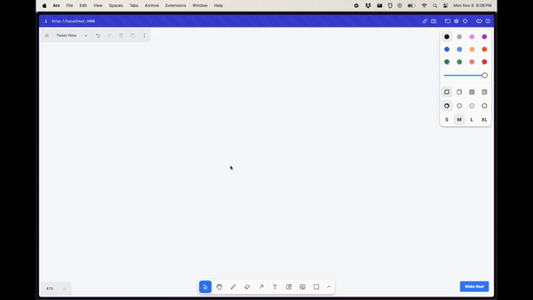

# Shubh's Draw-A-UI

This app leverages tldraw and the GPT-4 Vision API to transform your wireframe sketches into fully functional HTML with Tailwind styling. It provides an innovative way to rapidly prototype your UI designs by simply drawing them out.

> Note: This version integrates Shubh's design insights, aiming to improve usability and visual consistency. The inspiration is rooted in a blend of creative design and cutting-edge AI technology.



## How It Works

- Draw your UI wireframe using tldraw.
- The app captures the current canvas as an SVG and converts it to a PNG image.
- The PNG is sent to GPT-4 Vision with instructions to return a single HTML file, styled with Tailwind CSS.

> Disclaimer: This demo app is for experimental purposes only. It does not include authentication, so deploying it publicly may lead to unforeseen costs. Use it for prototyping and learning.

## Getting Started

This is a Next.js app. To get started, follow the commands below in the root directory of the project. You will need an OpenAI API key with access to the GPT-4 Vision API.

> Requirements: Next.js 14 and Node version greater than 18.17. [Read more here](https://nextjs.org/docs/pages/building-your-application/upgrading/version-14).

```bash
# Create an environment file with your OpenAI API key
echo "OPENAI_API_KEY=sk-your-key" > .env.local

# Install dependencies
npm install

# Start the development server
npm run dev
```

<!-- Insert new content -->
## Project Structure

The codebase is organized as follows:

- **Root Files:** Includes configuration and metadata files such as `LICENSE`, `next.config.js`, `package.json`, `postcss.config.js`, `tailwind.config.ts`, and `tsconfig.json`.

- **app/**
  - `globals.css`: Global styles for the application.
  - `layout.tsx`: Main layout component.
  - `page.tsx`: The home page of the app.
  - `api/toHtml/route.ts`: API route that converts the canvas to HTML.

- **components/**
  - `PreviewModal.tsx`: A modal component for previewing UI output.

- **lib/**
  - Contains utility functions including `blobToBase64.ts`, `getBrowserCanvasMaxSize.ts`, `getSvgAsImage.ts`, and `png.ts`.

- **public/**
  - Hosts static assets and images.
<!-- End of insert -->

Open https://mern-end-9wtwtcmir-idleshubh-gmailcoms-projects.vercel.app/ in your browser to see the app in action.
